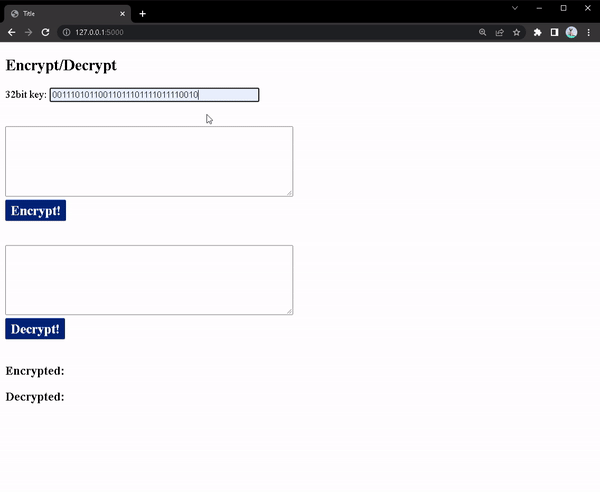
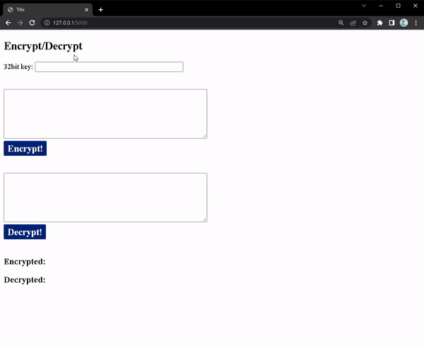

# About

This application is using a block cipher to encrypt and decrypt text. The block cipher was implemented by me during an assignment in Applied cryptography (INF143a) at University of Bergen 2022   

The code had to be modified a bit so that the user doesn't have to worry about input length and format  

Maybe add possibility for encrypting/decrypting images in the future...

**This is *NOT* a secure encryption scheme, only a small fun project**  
The key size used in this cipher is only 32bit

## Demo  

### Encryption  

  

### Decryption  

